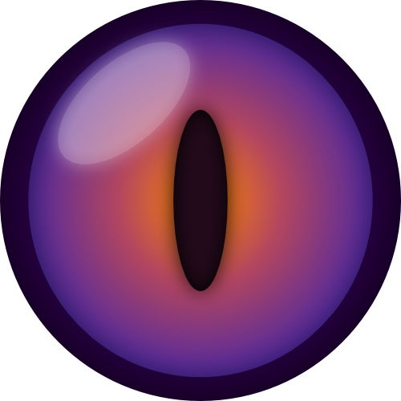
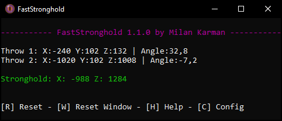
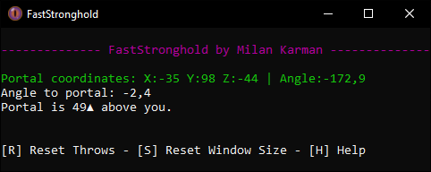
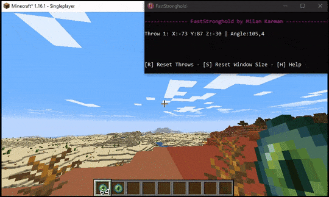
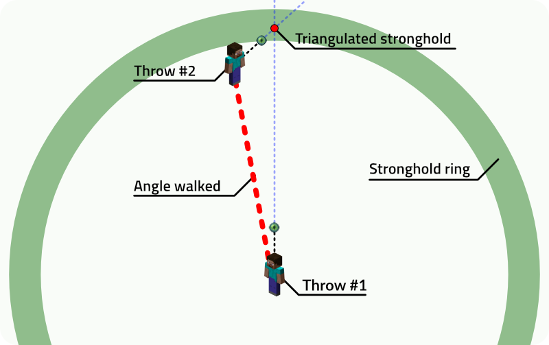

 

  

  <h2 align="center">FastStronghold</h2>

  

    <i>A Minecraft stronghold triangulation tool, optimized for speedrunning.</i>
     
    <!-- <a href="">Video Tutorial (To be done)</a>
    - -->
    <a href="https://github.com/milankarman/fast-stronghold/issues">Report Issue</a>
    -
    <a href="https://github.com/milankarman/fast-stronghold/issues">Request Feature</a>
  

## Table of Contents

* [About](#about)
  * [Features](#features)
  * [Screenshots](#screenshots)
  * [Legality](#legality)
* [Usage](#usage)
  * [Stronghold Triangulation](#stronghold-triangulation)
  * [Nether Portal Tracking](#nether-portal-tracking)
  * [Video Tutorial](#video-tutorial)
  * [Troubleshooting](#troubleshooting)
* [Download & Installation](#download-&-installation)

## About

There are various stronghold finder tools already available but most of them are not made for the purpose of speedrunning. However, FastStronghold is optimized with speedrunning first and foremost, being fast to use and super optimized so it saves you as much time as possible when speedrunning.

Using FastStronghold can save you time and lower the chance of your runs being killed by eye breaks by only requiring 2 eye of ender throws and removing manual triangulation steps. All while being extremely accurate if used properly.

### Features
* This program reads from the clipboard when you use F3+C, which means there is no need to manually input coordinates.
* Super low RAM and CPU usage making it so you don't have to worry about performance.
* Built in nether portal tracking to help you keep your bearing easily without having a chat or friend backseating you.
* Small and always on top so it's easy to fit among your other windows, and always visible.
* A very minimalistic design showing you only what you need to know without distractions.

### Screenshots

  
   
    <i>FastStronghold calculating the stronghold location from two throws.</i>
   
   
  
     
    <i>FastStronghold keeping track of your nether portal location and calculating the way back.</i>
   
   
  
   
    <i>FastStronghold's result matching the in game stronghold location.</i>
   
   
  
   
  <i>Nether portal tracker showing the way back to your portal.</i>
   
  Note: the FastStronghold window can be placed anywhere on your desktop or secondary monitors.

### Legality

FastStronghold finds the stronghold by reading the coordinates noted in the command that is put on your clipboard by Minecraft when you press F3+C. From there it uses math from the two points you give it to locate the stronghold. This is allowed in current Minecraft speedruns. Quoting the Minecraft speedrunning discord:
> Q: Is a stronghold finder allowed?

> A: Yes, but no. Any stronghold/structure finder website that asks for seed input is not allowed. You are not allowed to use or see the seed of the world you’re in. However, stronghold calculators that take 2 angles as an input and locates the stronghold using math are allowed.

The built in nether portal tracking works the same way, reading the coordinates from the clipboard when you press F3+C in the nether and calculating the angle towards the first coordinates you set when you entered the nether.

FastStronghold **never** accesses Minecraft's game memory, and anything it can do could be realistically done using math during runs by a stream chatter or backseating friend.

## Usage

### Stronghold Triangulation

Make sure you have FastStronghold open before starting your run so you don't have to waste any time getting it ready when you need it.

1. Start by doing your first throw soon after you exit the nether. Make sure you are standing completely still when you do your throw, then point your crosshair **exactly** at the center of the eye of ender when it floats in the sky. While holding your cursor on the center of the eye press F3+C in Minecraft, after which a message in chat will appear saying *"[Debug]: Copied location to clipboard"*.

2. The coordinates at which you did your throw will show up in FastStronghold. For the second throw we want to move a good amount off from the angle that our first throw gave us. There are multiple ways you can move off this angle in a speedrun, like turning 90° away from the angle in either direction and then walking about 200 blocks in that direction to do your second throw. Or following the angle of your first throw, but changing it by ~10° in either direction and doing your next throw once you start nearing the region where the stronghold can spawn. The latter is the method I recommend and it is illustrated in the image below.

  
   
  <i>The actual angle you walk can be less steep than this example and the results should still be accurate as long as you align your corsshair to the ender eye well. I would recommend running on your off-angle for about 1400 blocks before doing your second throw.</i>

 
3. After you have travelled far enough to do your second throw you are going to stay still once again, do your throw then point your crosshair directly at the center of the floating eye and press F3+C. FastStronghold will once again update and will now tell you the coordinates of the stronghold. Simply head over there and dig down and the stronghold should be right there.

After doing a run where you have used F3+C it is recommended to reset your throws by pressing R with the FastStronghold window active.

### Nether Portal Tracking

Make sure that you have FastStronghold open before you start your speedrun. Now as soon as you enter the nether hit F3+C. FastStronghold will remember that location as your portal location and it will be shown on the FastStronghold display. Now any time you press F3+C the FastStronghold display will calculate in what direction your portal is and it will tell you the height difference between you and your portal.

### Video Tutorial

Coming soon...

### Troubleshooting

> *I accidentally pressed F3+C at the wrong time, what do I do?*
>
> FastStronghold uses the last two throws you did to calculate the angle. So if it's your first eye throw then you can press F3+C again from the correct angle, then do the same for your second throw and FastStronghold will update with the new stronghold coordinates. If you messed up further into the triangulation I recommend doing two new throws with a reasonable distance (off the throw angle) between them.

> *The stronghold wasn't at the coordinates FastStronghold said.*
>
> The formula used by FastStronghold is generally known to be reliable. It is most likely
> a user error was made. Ensure you are aligning your cursor with exactly the center of 
> the eye of ender when doing your throws, and make sure you haven't moved from the spot where you started
> the eye throw until you have pressed F3+C with the correct angle.  
> If you are still in a run then you can improvise and do another two throws to try triangulating again.
> ***If you believe there was an error that wasn't caused by the user, please open an issue.***

> *I encountered a different issue!*
>
> Please see this repositories issues page and if your issue isn't in there already, make a new one. Thank you.

## Download & Installation

To be added