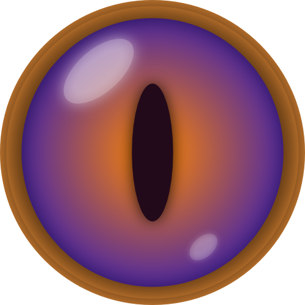

<!-- PROJECT LOGO -->
 

  

  <h2 align="center">FastStronghold</h2>

  

    <i>A stronghold triangulation tool, optimized for speedrunning.</i>
     
    <a href="">View Demo</a>
    -
    <a href="https://github.com/milankarman/fast-stronghold/issues">Report Bug</a>
    -
    <a href="https://github.com/milankarman/fast-stronghold/issues">Request Feature</a>
  

## Table of Contents

* [About](#about-the-project)
  * [Features](#features)
  * [Legality](#legality)
* [Usage](#usage)
  * [Instructions](#instructions)
  * [Video](#Video)
* [Download/Installation](#download/installation)

## About

There are various stronghold finder tools already available but most of them are not made for the purpose of speedrunning. However FastStronghold is optimized with speedrunning first and foremost, being fast to use and super optimized so it saves you as much time as possible when speedrunning.

### Features
* Reading directly from clipboard means there is no need to manually input coordinates.
* Super low RAM and CPU usage making it so you don't have to worry about performance.
* Built in Nether portal tracking to help you keep your bearing easily without having a chat or friend backseating you.
* Small and always on top so it's easy to fit among your other windows, and always visible.
* Very minimalistic design showing you only what you need to know without distractions.

## Usage

Use this space to show useful examples of how a project can be used. Additional screenshots, code examples and demos work well in this space. You may also link to more resources.

### Instructions

To be done

### Video

To be done

## Download/Installation

To be done